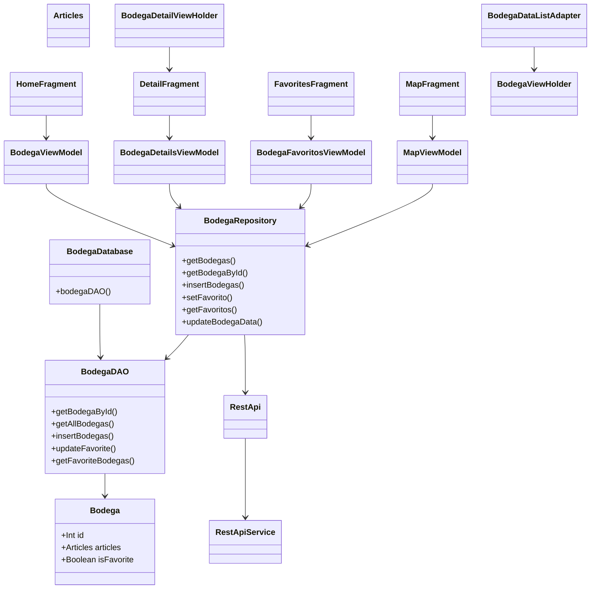

# Aplicación Android de Bodegas, Llagares y Queserías de Asturias

## **Funcionalidades de la aplicación**

- Visualización de una lista de bodegas, llagares y queserías de Asturias.
- Búsqueda y filtrado de bodegas por nombre, zona y concejo.
- Marcado y gestión de bodegas favoritas.
- Visualización de detalles completos de cada bodega, incluyendo imágenes, horarios, dirección, web y teléfonos.
- Acceso rápido a la web de la bodega y llamada directa a los teléfonos de contacto.
- Mapa interactivo con localización de todas las bodegas y acceso a sus detalles.
- Configuración de idioma (español/inglés) y tema (claro/oscuro).
- Ocultación de la barra de navegación para una experiencia de usuario más inmersiva.
- Persistencia de datos y favoritos mediante base de datos local.
- Actualización automática de datos desde un servicio web.

## **Arquitectura de la aplicación**

La aplicación sigue una arquitectura basada en MVVM (Model-View-ViewModel), que separa claramente la lógica de negocio, la gestión de datos y la interfaz de usuario.

- Model: Incluye las entidades de datos (Bodega, Articles, etc.), la base de datos local (BodegaDatabase, BodegaDAO) y los adaptadores de conversión de datos.
- Repository: El repositorio (BodegaRepository) actúa como intermediario entre la base de datos local y la red, proporcionando una fuente única de datos para la aplicación.
- ViewModel: Los ViewModels (BodegaViewModel, BodegaDetailsViewModel, etc.) gestionan la lógica de presentación y exponen los datos a la UI mediante LiveData.
- View/UI: Los Fragments y Adapters (HomeFragment, DetailFragment, BodegaDataListAdapter, etc.) muestran los datos y gestionan la interacción con el usuario.
- Network: La capa de red (RestApi, RestApiService) se encarga de obtener los datos desde el servicio web.

## Capa de Presentación (UI/View)

Encargada de la interacción con el usuario, mostrando datos y recibiendo acciones.

### Fragmentos

MainActivity: Actividad principal que gestiona la navegación, preferencias, idioma, tema y visibilidad de la barra de navegación.
DetailFragment: Muestra los detalles de una bodega seleccionada.
MapFragment: Muestra un mapa con marcadores de bodegas.
SettingsFragment: Permite al usuario cambiar preferencias como idioma y tema.
FilterDialogFragment: Diálogo para filtrar bodegas por zona y concejo.
AppUIState: Sello que representa el estado de la UI (éxito, error, cargando).

### Adaptadores

BodegaDetailViewHolder: Gestiona la vista de detalle de una bodega.
BodegaViewHolder: Gestiona la vista de cada elemento de la lista de bodegas.
BodegaDataListAdapter: Adaptador para la lista de bodegas en un RecyclerView.
ImagePagerAdapter: Adaptador para mostrar imágenes en un ViewPager.

2. Capa de Dominio (ViewModel y lógica de negocio)
Contiene la lógica de negocio y la gestión de datos entre la UI y el repositorio.

Clases principales:

BodegaViewModel: Gestiona la obtención y filtrado de bodegas para la UI principal.
BodegaViewModelFactory: Crea instancias de BodegaViewModel.
BodegaDetailsViewModel: Gestiona la obtención de detalles de una bodega específica.
BodegaDetailsViewModelFactory: Crea instancias de BodegaDetailsViewModel.
BodegaFavoritosViewModel: Gestiona la lógica de favoritos y filtrado de bodegas favoritas.
BodegaFavoritosViewModelFactory: Crea instancias de BodegaFavoritosViewModel.
MapViewModel: Gestiona la obtención de bodegas para el mapa.
MapViewModelFactory: Crea instancias de MapViewModel.

3. Capa de Datos (Repositorio y acceso a datos)
Gestiona el acceso a la base de datos local y a la red.

Clases principales:

BodegaRepository: Proporciona una interfaz unificada para acceder a los datos de bodegas, ya sea desde la base de datos local o desde la red.
Converters: Convierte objetos complejos a JSON y viceversa para almacenarlos en la base de datos.

4. Capa de Red (API y adaptadores)
Gestiona la obtención de datos desde servicios web.

Clases principales:

RestApi: Singleton que expone el servicio de red.
RestApiService: Interfaz de Retrofit para obtener datos de la API.
EmailAdapter: Adaptador personalizado para deserializar listas de emails en la respuesta JSON.

5. Capa de Modelo (Entidades y DAO)
Define las estructuras de datos y el acceso a la base de datos.

Clases principales:

Bodega: Entidad principal que representa una bodega.
BodegaDAO: Interfaz DAO para acceder a la base de datos Room.
BodegaDatabase: Clase que define la base de datos Room.

6. Capa de Utilidades
Funciones auxiliares y extensiones.

Clases principales:
LiveDataExtensions: Extensión para observar LiveData una sola vez.
AppState: Enum para representar el estado de la aplicación.

